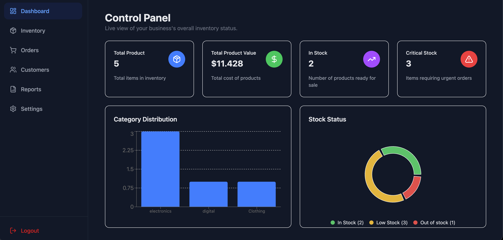

# 📦 React Modern Inventory Dashboard

A comprehensive, responsive, and modern inventory management dashboard built with **React**, **TypeScript**, and **Tailwind CSS**. This application helps businesses track products, manage orders, and analyze customers with an intuitive user interface and interactive data visualization.



## ✨ Features

- **🎨 Modern UI/UX:** Clean interface designed with Tailwind CSS.
- **🌓 Dark/Light Mode:** Fully supported theme toggling with Redux persistence.
- **📊 Interactive Charts:** Data visualization for sales and category distribution using Recharts.
- **📦 Inventory Management:** Search, filter, and manage products efficiently.
- **👥 Customer & Order Tracking:** Detailed views for customer history and order status.
- **📱 Fully Responsive:** Optimized for desktop, tablet, and mobile devices.
- **⚡ Fast Performance:** Powered by Vite and optimized state management.

## 🛠️ Tech Stack

- **Framework:** [React](https://reactjs.org/) (via [Vite](https://vitejs.dev/))
- **Language:** [TypeScript](https://www.typescriptlang.org/)
- **Styling:** [Tailwind CSS](https://tailwindcss.com/)
- **State Management:** [Redux Toolkit](https://redux-toolkit.js.org/)
- **Charts:** [Recharts](https://recharts.org/)
- **Icons:** [Lucide React](https://lucide.dev/)
- **HTTP Client:** Axios
- **Mock Backend:** JSON Server

  ## 🚀 Getting Started

Follow these instructions to set up the project locally on your machine.

### Prerequisites

Make sure you have **Node.js** installed.

### Installation

1. **Clone the repository:**
   ```bash
   git clone [https://github.com/Erdem-Baran/react-modern-inventory-dashboard.git](https://github.com/Erdem-Baran/react-modern-inventory-dashboard.git)
   cd react-modern-inventory-dashboard
   ```
2. **Install dependencies**
   ```bash
   npm install
   ```
3. ***Start the Mock Server (JSON Server): This project uses db.json as a mock database. Open a terminal and run***
   ```bash
   npx json-server --watch db.json --port 3001
   ```
4. ***Run the Application: Open a new terminal window and start the Vite dev server***
   ```bash
   npm run dev
   ```

.

📂 Project Structure
```
src/
├── api/            # Axios setup and API services
├── components/     # Reusable UI components (Sidebar, Header, etc.)
├── layouts/        # Layout wrappers (DashboardLayout)
├── pages/          # Application pages (Dashboard, Products, Orders, etc.)
├── store/          # Redux store and slices (Theme, etc.)
├── types/          # TypeScript interfaces and types
├── lib/            # Utility functions
└── App.tsx         # Main application entry

```


"This project uses json-server for demonstration purposes. In a real-world production environment, strict authentication (JWT), server-side validation, and role-based access control (RBAC) would be implemented on a robust backend (like Node.js/Express, .NET or Go)."
